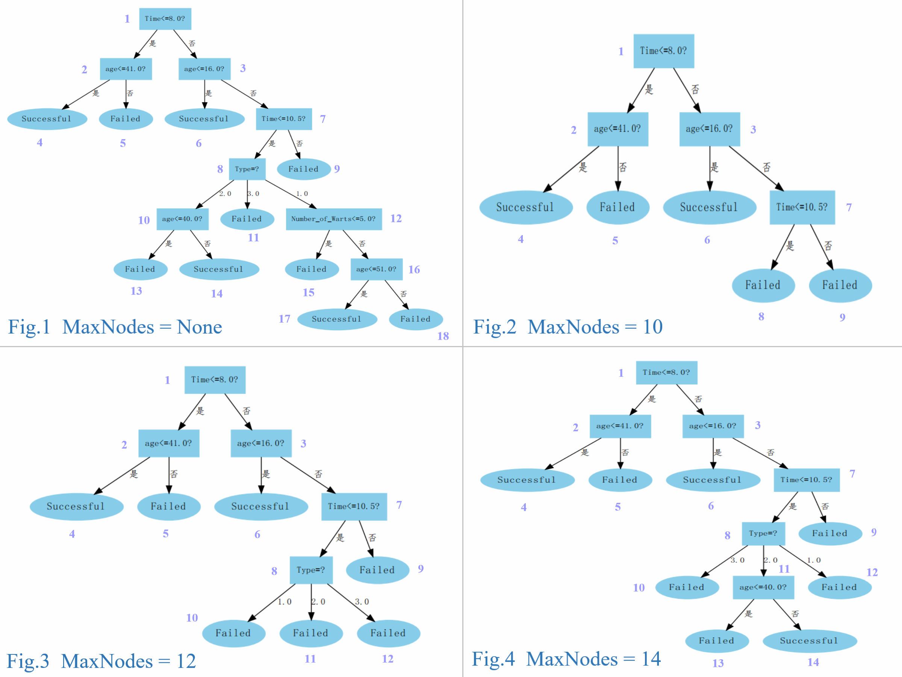

# Problem 4.8
试将决策树生成的深度优先搜索过程修改为广度优先搜索，以参数MaxNode控制树的最大结点数，将题4.7中基于队列（纠正：这里应该为栈，题4.7要控制MaxDepth，应该使用的数据结构是栈，而不是队列）的决策树算法进行改写。对比题4.7中的算法，试析哪种方式更易于控制决策树所需存储不超出内存。

## Dataset
UCI 冷冻疗法数据集 @ `../CrayoDataset.xlsx`  

## Environment
- `python 3.5.4`
- `xlrd 1.2.0`
- `numpy 1.18.5`
- `graphviz 0.14.2`

## Usage
```Shell
python3 test.py
```

## Result
  
Looking at Fig.2, MaxNodes is set as 10. The 8<sup>th</sup> node can't fork out the 10<sup>th</sup>, 11<sup>th</sup> and 12<sup>th</sup> nodes with the limit of MaxNodes. And the appropriate way is marking the 8<sup>th</sup> node as a leaf node. Thus, the number of the tree's nodes is 9 actually.  

I believe that the algorithm of 4.8 (controls number of nodes) could control the required storage of Decision Tree more effectively than the algorithm of 4.7 (controls depth). Because the required storage of Decision Tree depends on the number of nodes directly.