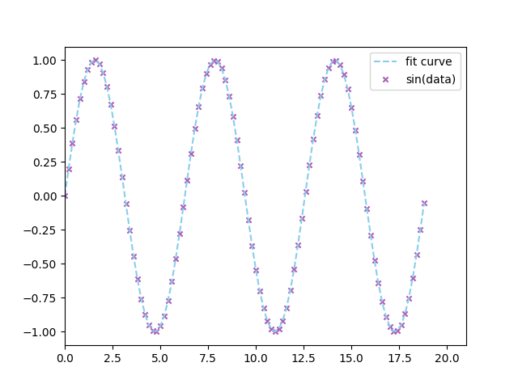

# Problem 6.8
以西瓜数据集3.0α的“密度”为输入，“含糖率”为输出，试使用LIBSVM（×）训练一个SVR。

## Dataset
西瓜数据集3.0α @ `../WTMLDataSet_3.0alpha.xlsx`
编号|	密度|	含糖率|	好瓜
|--| --|--|--|
1|	0.697|	0.46|	1|
2|	0.774|	0.376|	1|
3|	0.634|	0.264|	1|
4|	0.608|	0.318|	1|
5|	0.556|	0.215|	1|
6|	0.403|	0.237|	1|
7|	0.481|	0.149|	1|
8|	0.437|	0.211|	1|
9|	0.666|	0.091|	0|
10|	0.243|	0.267|	0|
11|	0.245|	0.057|	0|
12|	0.343|	0.099|	0|
13|	0.639|	0.161|	0|
14|	0.657|	0.198|	0|
15|	0.36|	0.37|	0|
16|	0.593|	0.042|	0|
17|	0.719|	0.103|	0|


## Environment
- `python 3.7.0`  
- `xlrd 1.2.0`  
- `tqdm 4.50.2`  
- `numpy 1.19.2`  
- `matplotlib 3.3.2`  

## Usage
```Shell
python3 test_alpha.py
```

## Outcome
  
In fact, there is no obvious direct relationship between sugar-content and density. But SVR with Gaussian kernel can still fit a curve well, just that the fitted function looks complicated.  

## P.S.
I also use SVR with Gaussian kernel to fit sine function, for test, as following:  
