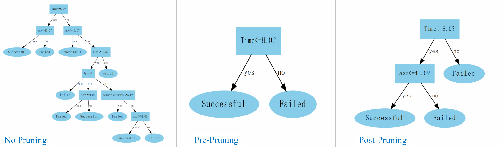
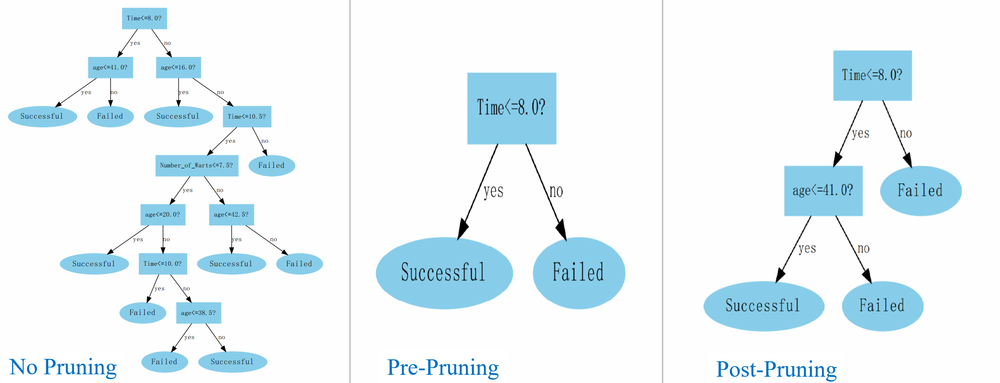
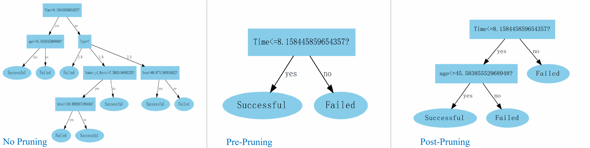

# Problem 4.6
试选择4个UCI数据集（这里只选择了1个进行测试），对上述3种算法所产生的未剪枝、预剪枝、后剪枝决策树进行实验比较，并进行适当的统计显著性检验。（UCI数据集见<http://archive.ics.uci.edu/ml/>.）

## Dataset
UCI 冷冻疗法数据集 @ `./Cryotherapy.xlsx`  

## Environment
- `python 3.5.4`  
- `xlrd 1.2.0`  
- `numpy 1.18.5`
- `graphviz 0.14.2`

## Usage
```Shell
python3 test.py
```

## Result
#### `Information Gain`
  
  

#### `Gini Index`  
  
  

#### `Logit Regression`  
  
  

#### Accuracy
| |No Pruning|Pre-Pruning|Post-Pruning|
|-|-|-|-|
|Information Gain| 0.7500 | 1.0000 | 1.0000|
|Gini Index | 0.8750 | 1.0000 | 1.0000 |
|Logit Regression | 0.8750 | 1.0000 | 1.0000|