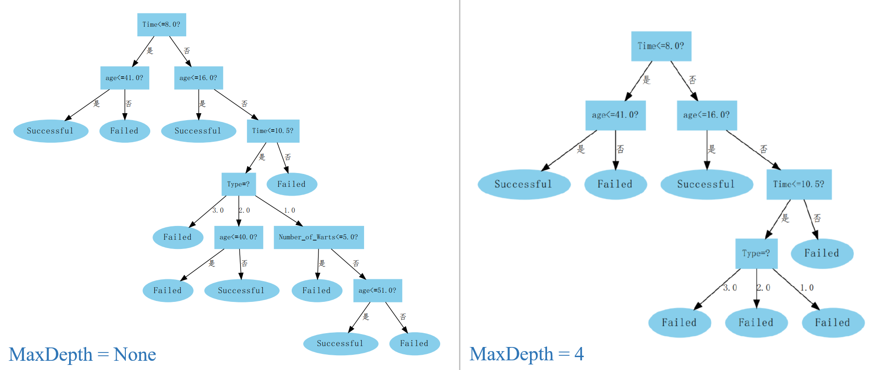

# Problem 4.7
图4.2是一个递归算法，若面临巨量数据，则决策树的层数会很深，使用递归方法易导致“栈”溢出。试使用“队列”（纠正：这里要控制树的最大深度，应该为“栈”）数据结构，以参数MaxDepth控制树的最大深度，写出与图4.2等价、但不使用递归的决策树生成算法。

## Dataset
UCI 冷冻疗法数据集 @ `../CrayoDataset.xlsx`  

## Environment
- `python 3.5.4`  
- `xlrd 1.2.0`  
- `numpy 1.18.5`
- `graphviz 0.14.2`

## Usage
```Shell
python3 test.py
```

## Result
  
So using Stack to contorl maximum of depth is effective.
