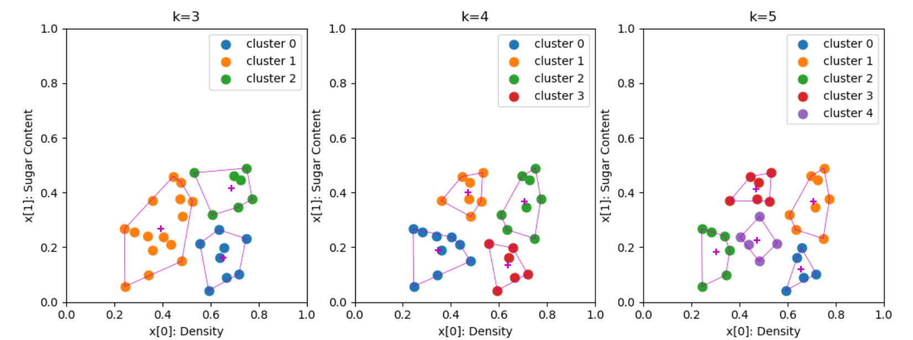

# Problem 9.4
试编程实现k均值算法，设置三组不同的k值、三组不同初始中心点，在西瓜数据集4.0上进行实验比较，并讨论什么样的初始中心有利于取得好结果 (这里只对不同的k值进行实验比较)。  

## Dataset
西瓜数据集4.0 @ `../WTMLDataSet_4.0.xlsx`
编号|	密度|	含糖率|
|--| --|--|
1|	0.697|	0.46|
2|	0.774|	0.376|
3|	0.634|	0.264|
4|	0.608|	0.318|
5|	0.556|	0.215|
6|	0.403|	0.237|
7|	0.481|	0.149|
8|	0.437|	0.211|
9|	0.666|	0.091|
10|	0.243|	0.267|
11|	0.245|	0.057|
12|	0.343|	0.099|
13|	0.639|	0.161|
14|	0.657|	0.198|
15|	0.36|	0.37|
16|	0.593|	0.042|
17|	0.719|	0.103|
18|	0.359|	0.188|
19|	0.339|	0.241|
20|	0.282|	0.257|
21|	0.748|	0.232|
22|	0.714|	0.346|
23|	0.483|	0.312|
24|	0.478|	0.437|
25|	0.525|	0.369|
26|	0.751|	0.489|
27|	0.532|	0.472|
28|	0.473|	0.376|
29|	0.725|	0.445|
30|	0.446|	0.459|


## Environment
- `python 3.7.0`  
- `xlrd 1.2.0`  
- `numpy 1.13.1`  
- `scipy 0.19.1`  
- `matplotlib 3.3.2`

## Usage
```Shell
python3 main.py
```

## Outcome
Clusters that K-means divides on dataset, with k = 3, 4, 5 respectively.  
  